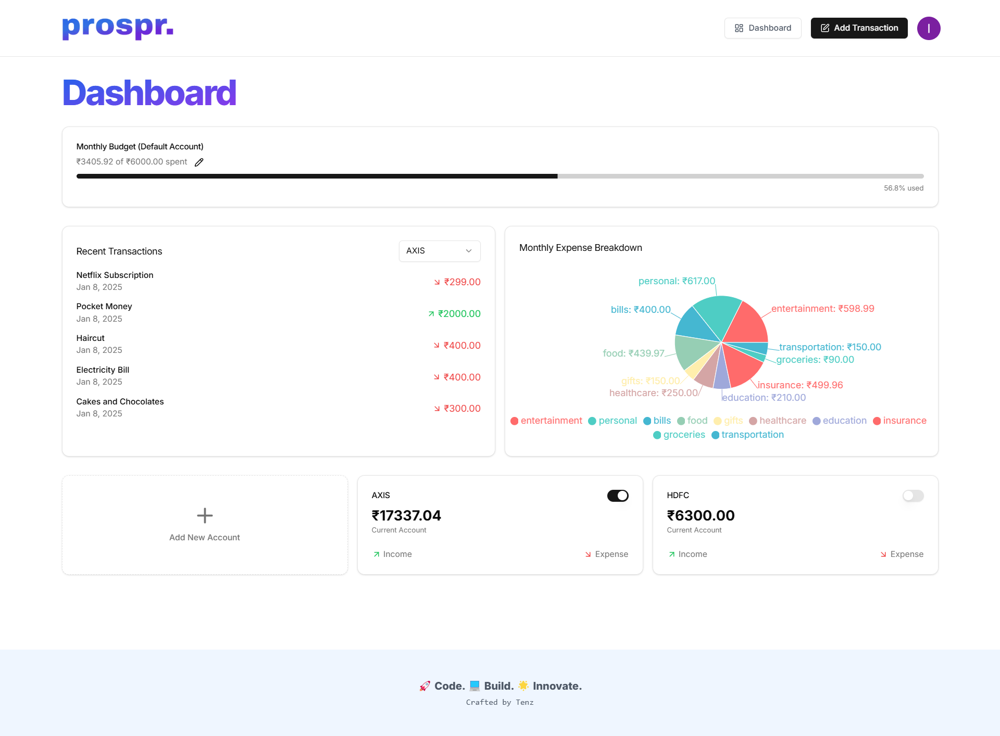

# **prospr.**

### Your Ultimate AI-Powered Finance Companion

*Take Control of Your Financial Future with Intelligent Automation*

## 🌟 Overview

**prospr.** is a comprehensive AI-driven finance management platform that takes the stress out of budgeting, expense tracking, and financial planning. By leveraging cutting-edge technologies and AI, **prospr.** helps users gain full control over their financial journeys with ease and efficiency.

What started as a basic finance management tool has now evolved into a full-stack solution that integrates AI-powered receipt scanning, dynamic graphs for financial insights, and automated budgeting. With a deep focus on user experience and intelligent data management, **prospr.** has successfully moved beyond simple tracking and into the realm of personal finance optimization.

## 🚀 Key Features

### AI-Powered Receipt Scanning
Powered by **Gemini AI**, **prospr.** instantly scans and extracts meaningful data from receipts. This allows you to effortlessly add transactions without manual entry, streamlining the process and reducing errors.

### Dynamic Financial Graphs
Visualize your financial data with beautiful, interactive graphs. Track your income, expenses, savings, and investments over time, providing you with actionable insights to make better financial decisions.

### Secure Account Management
Protect your financial data with state-of-the-art security measures and comprehensive account management features.

### Comprehensive Account Overview
Monitor and manage all your accounts in one centralized dashboard with our intuitive interface.

## 💡 How prospr. Helps You

- **Take Control of Your Money**: Gain complete visibility over your financial situation with real-time data updates, graphs, and insights. No more wondering where your money went—**prospr.** does the heavy lifting for you.

- **Save Time and Reduce Errors**: With the AI-powered receipt scanner, you'll save valuable time while reducing human error in expense entry. Simply scan a receipt, and **prospr.** takes care of the rest.

- **Achieve Financial Goals Faster**: With budgeting features and recurring expense tracking, you'll have the tools to stay on track with your goals. Whether it's building savings or paying off debt, **prospr.** makes it easier to manage your finances.

- **Smart Financial Planning**: **prospr.** helps you see the bigger picture with monthly and yearly insights. Make informed decisions about your finances and plan your future with confidence.

## 🛠️ Technology Stack

### Frontend
- **Next.js**: Fast, server-side rendering and optimal performance
- **Tailwind CSS**: Utility-first styling and responsive design
- **Shadcn UI**: Modern, sleek UI components prioritizing accessibility

### Backend
- **Supabase**: Backend-as-a-service with real-time syncing and user authentication
- **Prisma**: Efficient ORM for database management and querying
- **Inngest**: Event-driven automation and background task processing
- **ArcJet**: Scalable cloud infrastructure

## 📊 Core Features

1. **Monthly Budgeting**
   - Automatic monthly budget creation
   - Real-time tracking and adjustments
   - Goal-based budget recommendations

2. **Expense Management**
   - AI-powered receipt scanning
   - Automatic expense categorization
   - Recurring payments tracking

3. **Financial Analytics**
   - Interactive spending graphs
   - Monthly and yearly comparisons
   - Trend analysis and insights

4. **Security**
   - End-to-end encryption
   - Secure authentication
   - Regular security updates

## 📄 License

prospr. is licensed under the MIT License. See the [LICENSE](LICENSE) file for details.

## 🔒 Copyright Notice

---

**prospr.** - Empowering Your Financial Journey

[Documentation](docs) • [Community Support](support) • [Terms of Service](terms)

